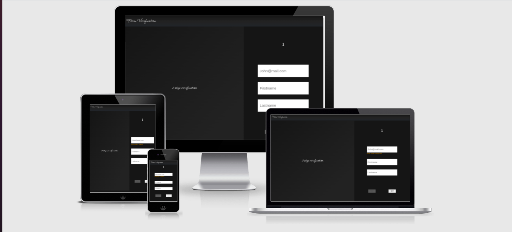

# Form Verification
This is a test Project aimed at testing my proficiency in Reactjs, Form validation, communication with Backend, How to write Test and Responsive Design.

## Screenshot :camera:

## Built with :heart:
- React
- Sass

## Live Link :link: :rocket: Coming Soon
 [Form Verification]()

## Set up :wrench:
- [ ] Clone the repo using the git command <code> git clone https://github.com/Haroonabdulrazaq/form-verification-fe.git</code>
- [ ] cd into the project directory <code> cd form-verification-fe</code>
- [ ] To install all dependencies in package.json, Run <code> npm install </code>
- [ ] To start the project <code> npm start </code>

NOTE: Make sure to Start the BAckend Before starting the FE; So that FE to start from http://localhost:3001

## Set Up Test
- [ ] After runnning <code> npm install </code>
- [ ] Run <code> npm run test </code>

## Prerequisite :hammer_and_wrench:
- Node  v16.13.2 or Higher version
- npm  6.14.13 or Higher version

## Work Done
- [ ] Set up React Environment
- [ ] Create a responsive Form
- [ ] Add Form validation (using Yup and Formik)
- [ ] Add some cool Animations
- [ ] Submit Form data to BE
- [ ] Add Notification after sucessfull or unsuccessful submissions
- [ ] Add Verification to users submission
- [ ] Add Few Test

## App Functionality
The application accepts some user information like the EMail Firstname LAstname and Password. 
The Application checks If the the users input conforms with the Validation Schema. If it does not, it will
show an Error just below the input tag.

The Application has 3 buttons, Which are displayed logocally. The Next button is shown on the first page while the Previous and Submit Button are shown on the Second page.

If the submit button is press and all the informationm is filled in, the application makes a POST request to the BE.

 ## Deploy :rocket: Coming Soon!
This project is deployed to [Amazon AWS]()

## Author :man:

👤 **Haroon Abdulrazaq**

- Github: [@githubhandle](https://github.com/Haroonabdulrazaq)
- Twitter: [@twitterhandle](https://twitter.com/hanq_o)
- Linkedin: [linkedin](https://www.linkedin.com/in/haroonabdulrazaq)
- Portfolio: [Portfolio](https://www.haroonabdulrazaq.tech)

## Show your support

Give a ⭐️ if you like this project!

## Acknowledgments
- I acknowlege [Anonymous Bank] for giving a concise and straight forward specification.

## 📝 License

This project is [MIT](lic.url) licensed.